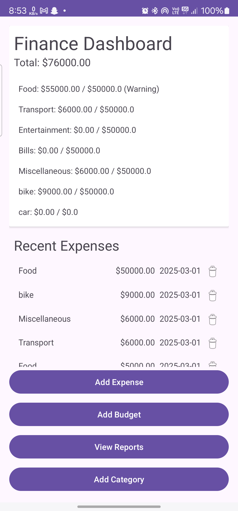
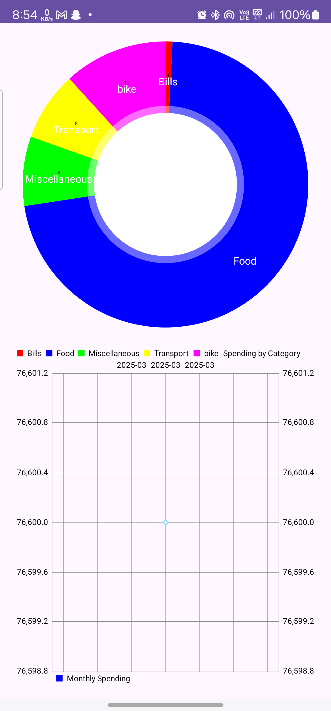
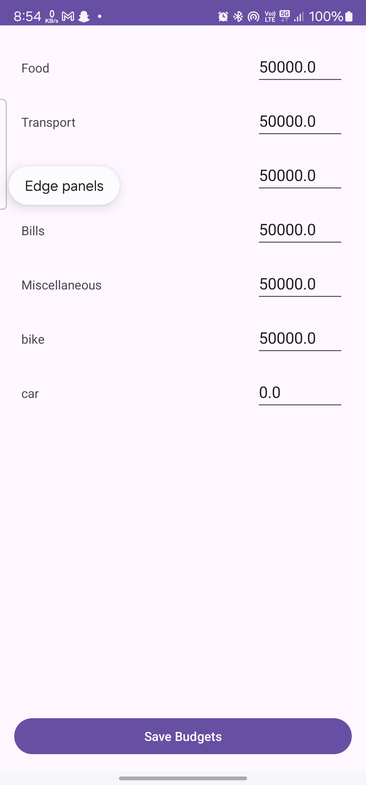

# Finance Mate 💰📊

**Finance Mate** is a personal finance tracker that helps you manage your expenses efficiently. With features like budget setting, expense tracking, and visual reports, you can take control of your spending habits.

## Features 🚀
- 📂 **Category-based Tracking** – Organize expenses under custom categories.
- 🎯 **Budget Setting** – Set spending limits to stay within your budget.
- 📊 **Expense Visualization** – Analyze your spending with interactive pie charts.
- ⚠️ **Budget Alerts** – Get warnings when you exceed your budget.

## Screenshots 📸
  
 
  

